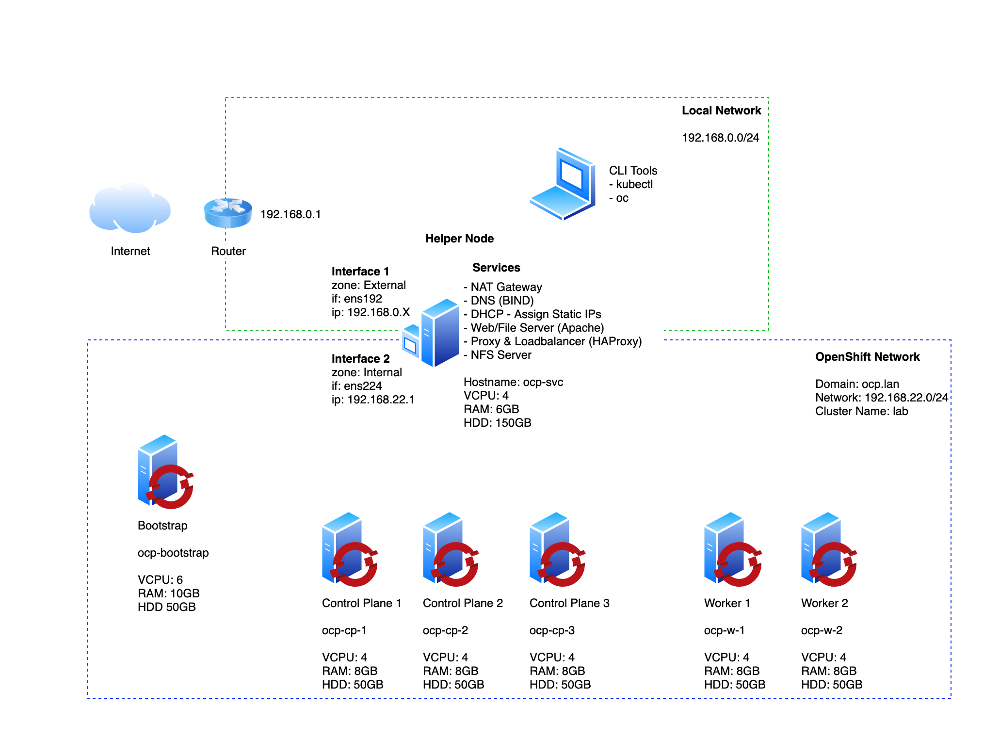

# OpenShift 4 Bare Metal Install - User Provisioned Infrastructure (UPI)

- https://access.redhat.com/solutions/5020331
- Refer official doc: https://docs.openshift.com/container-platform/4.17/installing/installing_platform_agnostic/installing-platform-agnostic.html#prerequisites
- For Troubleshooting scenarios: https://github.com/openshift/installer/blob/main/docs/user/troubleshooting.md
- ODF operator install steps ref link: https://docs.redhat.com/en/documentation/red_hat_openshift_data_foundation/4.9/html/deploying_and_managing_openshift_data_foundation_using_red_hat_openstack_platform/deploying_openshift_data_foundation_on_red_hat_openstack_platform_in_internal_mode#installing-openshift-data-foundation-operator-using-the-operator-hub_internal-osp

- virtualisation operator install steps: https://docs.openshift.com/container-platform/4.8/virt/install/installing-virt-web.html#:~:text=From%20the%20Administrator%20perspective%2C%20click,the%20Operator%20and%20click%20Install.

https://docs.redhat.com/en/documentation/openshift_container_platform/4.6/html/openshift_virtualization/openshift-virtualization-installation#virt-deploying-virt_installing-virt-web

- ACR (azure container registry) integration as per customer - https://docs.openshift.com/acs/3.67/integration/integrate-with-image-registries.html#manual-configuration-image-registry-acr_integrate-with-image-registries

- prereqs for rhel as worker node: https://docs.openshift.com/container-platform/4.10/machine_management/adding-rhel-compute.html#rhel-preparing-node_adding-rhel-compute

------------
- [OpenShift 4 Bare Metal Install - User Provisioned Infrastructure (UPI)](#openshift-4-bare-metal-install---user-provisioned-infrastructure-upi)
  - [Architecture Diagram](#architecture-diagram)
  - [Download Software](#download-software)
  - [Prepare the 'Bare Metal' environment](#prepare-the-bare-metal-environment)
  - [Configure Environmental Services](#configure-environmental-services)
  - [Generate and host install files](#generate-and-host-install-files)
  - [Deploy OpenShift](#deploy-openshift)
  - [Monitor the Bootstrap Process](#monitor-the-bootstrap-process)
  - [Remove the Bootstrap Node](#remove-the-bootstrap-node)
  - [Wait for installation to complete](#wait-for-installation-to-complete)
  - [Join Worker Nodes](#join-worker-nodes)
  - [Configure storage for the Image Registry](#configure-storage-for-the-image-registry)
  - [Create the first Admin user](#create-the-first-admin-user)
  - [Access the OpenShift Console](#access-the-openshift-console)
  - [Troubleshooting](#troubleshooting)

## Architecture Diagram



## Download Software

1. Download [CentOS 8 x86_64 image](https://www.centos.org/centos-linux/)
1. Login to [RedHat OpenShift Cluster Manager](https://cloud.redhat.com/openshift)
1. Select 'Create Cluster' from the 'Clusters' navigation menu
1. Select 'RedHat OpenShift Container Platform'
1. Select 'Run on Bare Metal'
1. Download the following files:

   - Openshift Installer for Linux
   - Pull secret
   - Command Line Interface for Linux and your workstations OS
   - Red Hat Enterprise Linux CoreOS (RHCOS)
     - rhcos-X.X.X-x86_64-metal.x86_64.raw.gz
     - rhcos-X.X.X-x86_64-installer.x86_64.iso (or rhcos-X.X.X-x86_64-live.x86_64.iso for newer versions)

## Prepare the 'Bare Metal' environment

> VMware ESXi used in this guide

1. Copy the CentOS 8 iso to an ESXi datastore
1. Create a new Port Group called 'OCP' under Networking
    - (In case of VirtualBox choose "Internal Network" when creating each VM and give it the same name. ocp for instance)
    - (In case of ProxMox you may use the same network bridge and choose a specific VLAN tag. 50 for instance) 
1. Create 3 Control Plane virtual machines with minimum settings:
   - Name: ocp-cp-# (Example ocp-cp-1)
   - 4vcpu
   - 8GB RAM
   - 50GB HDD
   - NIC connected to the OCP network
   - Load the rhcos-X.X.X-x86_64-installer.x86_64.iso image into the CD/DVD drive
1. Create 2 Worker virtual machines (or more if you want) with minimum settings:
   - Name: ocp-w-# (Example ocp-w-1)
   - 4vcpu
   - 8GB RAM
   - 50GB HDD
   - NIC connected to the OCP network
   - Load the rhcos-X.X.X-x86_64-installer.x86_64.iso image into the CD/DVD drive
1. Create a Bootstrap virtual machine (this vm will be deleted once installation completes) with minimum settings:
   - Name: ocp-boostrap
   - 4vcpu
   - 8GB RAM
   - 50GB HDD
   - NIC connected to the OCP network
   - Load the rhcos-X.X.X-x86_64-installer.x86_64.iso image into the CD/DVD drive
1. Create a Services virtual machine with minimum settings:
   - Name: ocp-svc
   - 4vcpu
   - 4GB RAM
   - 120GB HDD
   - NIC1 connected to the VM Network (LAN)
   - NIC2 connected to the OCP network
   - Load the CentOS_8.iso image into the CD/DVD drive
1. Boot all virtual machines so they each are assigned a MAC address
1. Shut down all virtual machines except for 'ocp-svc'
1. Use the VMware ESXi dashboard to record the MAC address of each vm, these will be used later to set static IPs

## Configure Environmental Services

1. Install CentOS8 on the ocp-svc host

   - Remove the home dir partition and assign all free storage to '/'
   - Optionally you can install the 'Guest Tools' package to have monitoring and reporting in the VMware ESXi dashboard
   - Enable the LAN NIC only to obtain a DHCP address from the LAN network and make note of the IP address (ocp-svc_IP_address) assigned to the vm

1. Boot the ocp-svc VM

1. Move the files downloaded from the RedHat Cluster Manager site to the ocp-svc node

   ```bash
   scp ~/Downloads/openshift-install-linux.tar.gz ~/Downloads/openshift-client-linux.tar.gz ~/Downloads/rhcos-metal.x86_64.raw.gz root@{ocp-svc_IP_address}:/root/
   ```

1. SSH to the ocp-svc vm

   ```bash
   ssh root@{ocp-svc_IP_address}
   ```

1. Extract Client tools and copy them to `/usr/local/bin`

   ```bash
   tar xvf openshift-client-linux.tar.gz
   mv oc kubectl /usr/local/bin
   ```

1. Confirm Client Tools are working

   ```bash
   kubectl version
   oc version
   ```

1. Extract the OpenShift Installer

   ```bash
   tar xvf openshift-install-linux.tar.gz
   ```

1. Update CentOS so we get the latest packages for each of the services we are about to install

   ```bash
   dnf update
   ```

1. Install Git

   ```bash
   dnf install git -y
   ```

1. Download [config files](https://github.com/ryanhay/ocp4-metal-install) for each of the services

   ```bash
   git clone https://github.com/ryanhay/ocp4-metal-install
   ```

1. OPTIONAL: Create a file '~/.vimrc' and paste the following (this helps with editing in vim, particularly yaml files):

   ```bash
   cat <<EOT >> ~/.vimrc
   syntax on
   set nu et ai sts=0 ts=2 sw=2 list hls
   EOT
   ```

   Update the preferred editor

   ```bash
   export OC_EDITOR="vim"
   export KUBE_EDITOR="vim"
   ```

1. Set a Static IP for OCP network interface `nmtui-edit ens224` or edit `/etc/sysconfig/network-scripts/ifcfg-ens224`

   - **Address**: 192.168.22.1
   - **DNS Server**: 127.0.0.1
   - **Search domain**: ocp.lan
   - Never use this network for default route
   - Automatically connect

   > If changes arent applied automatically you can bounce the NIC with `nmcli connection down ens224` and `nmcli connection up ens224`

1. Setup firewalld

   Create **internal** and **external** zones

   ```bash
   nmcli connection modify ens224 connection.zone internal
   nmcli connection modify ens192 connection.zone external
   ```

   View zones:

   ```bash
   firewall-cmd --get-active-zones
   ```

   Set masquerading (source-nat) on the both zones.

   So to give a quick example of source-nat - for packets leaving the external interface, which in this case is ens192 - after they have been routed they will have their source address altered to the interface address of ens192 so that return packets can find their way back to this interface where the reverse will happen.

   ```bash
   firewall-cmd --zone=external --add-masquerade --permanent
   firewall-cmd --zone=internal --add-masquerade --permanent
   ```

   Reload firewall config

   ```bash
   firewall-cmd --reload
   ```

   Check the current settings of each zone

   ```bash
   firewall-cmd --list-all --zone=internal
   firewall-cmd --list-all --zone=external
   ```

   When masquerading is enabled so is ip forwarding which basically makes this host a router. Check:

   ```bash
   cat /proc/sys/net/ipv4/ip_forward
   ```

1. Install and configure BIND DNS

   Install

   ```bash
   dnf install bind bind-utils -y
   ```

   Apply configuration

   ```bash
   \cp ~/upi-rie/dns/named.conf /etc/named.conf
   \cp -R ~/upi-rie/dns/zones /etc/named/
   ```

   Configure the firewall for DNS

   ```bash
   firewall-cmd --add-port=53/udp --permanent
   # for OCP 4.9 and later 53/tcp is required
   firewall-cmd --add-port=53/tcp --permanent
   firewall-cmd --reload
   ```

   Enable and start the service

   ```bash
   systemctl enable named
   systemctl start named
   systemctl restart named
   systemctl status named
   ```

   > At the moment DNS will still be pointing to the LAN DNS server. You can see this by testing with `dig ocp.lan`.

   Change the LAN nic (ens192) to use 127.0.0.1 for DNS AND ensure `Ignore automatically Obtained DNS parameters` is ticked

   ```bash
   nmtui-edit ens192
   ```

   Restart Network Manager

   ```bash
   systemctl restart NetworkManager
   ```

   Confirm dig now sees the correct DNS results by using the DNS Server running locally

   ```bash
   dig ocp.lan
   # The following should return the answer ocp-bootstrap.lab.ocp.lan from the local server
   dig -x 192.168.22.200
   ```

1. Install & configure DHCP

   Install the DHCP Server

   ```bash
   dnf install dhcp-server -y
   ```

   Edit dhcpd.conf from the cloned git repo to have the correct mac address for each host and copy the conf file to the correct location for the DHCP service to use

   ```bash
   \cp ~/upi-rie/dhcpd.conf /etc/dhcp/dhcpd.conf
   ```

   Configure the Firewall

   ```bash
   firewall-cmd --add-service=dhcp --zone=internal --permanent
   firewall-cmd --reload
   ```

   Enable and start the service

   ```bash
   systemctl enable dhcpd
   systemctl start dhcpd
   systemctl restart dhcpd
   systemctl status dhcpd
   ```

1. Install & configure Apache Web Server

   Install Apache

   ```bash
   dnf install httpd -y
   ```

   Change default listen port to 8080 in httpd.conf

   ```bash
   sed -i 's/Listen 80/Listen 0.0.0.0:8080/' /etc/httpd/conf/httpd.conf
   ```

   Configure the firewall for Web Server traffic

   ```bash
   firewall-cmd --add-port=8080/tcp --permanent
   firewall-cmd --reload
   ```

   Enable and start the service

   ```bash
   systemctl enable httpd
   systemctl start httpd
   systemctl restart httpd
   systemctl status httpd
   ```

   Making a GET request to localhost on port 8080 should now return the default Apache webpage

   ```bash
   curl localhost:8080
   ```

1. Install & configure HAProxy

   Install HAProxy

   ```bash
   dnf install haproxy -y
   ```

   Copy HAProxy config

   ```bash
   \cp ~/upi-rie/haproxy.cfg /etc/haproxy/haproxy.cfg
   ```

   Configure the Firewall

   > Note: Opening port 9000 in the external zone allows access to HAProxy stats that are useful for monitoring and troubleshooting. The UI can be accessed at: `http://{ocp-svc_IP_address}:9000/stats`

   ```bash
   firewall-cmd --add-port=6443/tcp --permanent # kube-api-server on control plane nodes
   firewall-cmd --add-port=6443/tcp --permanent # kube-api-server on control plane nodes
   firewall-cmd --add-port=22623/tcp --permanent # machine-config server
   firewall-cmd --add-service=http --permanent # web services hosted on worker nodes
   firewall-cmd --add-service=http --permanent # web services hosted on worker nodes
   firewall-cmd --add-service=https --permanent # web services hosted on worker nodes
   firewall-cmd --add-service=https --permanent # web services hosted on worker nodes
   firewall-cmd --add-port=9000/tcp --permanent # HAProxy Stats
   firewall-cmd --reload
   ```

   Enable and start the service

   ```bash
   setsebool -P haproxy_connect_any 1 # SELinux name_bind access
   systemctl enable haproxy
   systemctl start haproxy
   systemctl restart haproxy
   systemctl status haproxy
   ```

1. Install and configure NFS for the OpenShift Registry. It is a requirement to provide storage for the Registry, emptyDir can be specified if necessary.

   Install NFS Server

   ```bash
   dnf install nfs-utils -y
   ```

   Create the Share

   Check available disk space and its location `df -h`

   ```bash
   mkdir -p /shares/registry
   chown -R nobody:nobody /shares/registry
   chmod -R 777 /shares/registry
   ```

   Export the Share

   ```bash
   echo "/shares/registry  10.32.1.0/24(rw,sync,root_squash,no_subtree_check,no_wdelay)" > /etc/exports
   exportfs -rv
   ```

   Set Firewall rules:

   ```bash
   firewall-cmd --add-service mountd --permanent
   firewall-cmd --add-service rpc-bind --permanent
   firewall-cmd --add-service nfs --permanent
   firewall-cmd --reload
   ```

   Enable and start the NFS related services

   ```bash
   systemctl enable nfs-server rpcbind
   systemctl start nfs-server rpcbind nfs-mountd
   systemctl restart nfs-server rpcbind nfs-mountd
   systemctl status nfs-server rpcbind nfs-mountd
   ```

## Generate and host install files

1. Generate an SSH key pair keeping all default options

   ```bash
   ssh-keygen
   ```

1. Create an install directory

   ```bash
   mkdir ~/ocp-riege
   ```

1. Copy the install-config.yaml included in the clones repository to the install directory

   ```bash
   cp ~/upi-rie/install-config.yaml ~/ocp-riege/
   ```

1. Update the install-config.yaml with your own pull-secret and ssh key.

   - Line 23 should contain the contents of your pull-secret.txt
   - Line 24 should contain the contents of your '~/.ssh/id_rsa.pub'

   ```bash
   vim ~/ocp-riege/install-config.yaml
   ```

1. Generate Kubernetes manifest files

   ```bash
   ./openshift-install create manifests --dir ~/ocp-riege
   ```
   ```bash
   mkdir ocp-riege-copy
   cp -r ocp-riege/ ocp-riege-copy
   ```

   > A warning is shown about making the control plane nodes schedulable. It is up to you if you want to run workloads on the Control Plane nodes. If you dont want to you can disable this with:
   > `sed -i 's/mastersSchedulable: true/mastersSchedulable: false/' ~/ocp-riege/manifests/cluster-scheduler-02-config.yml`.
   > Make any other custom changes you like to the core Kubernetes manifest files.


2. Remove the Kubernetes manifest files that define the control plane machines, compute machine sets, and control plane machine sets:
   ```bash
   rm -f openshift/99_openshift-cluster-api_master-machines-*.yaml openshift/99_openshift-cluster-api_worker-machineset-*.yaml openshift/99_openshift-machine-api_master-control-plane-machine-set.yaml
   ```

3. Check that the mastersSchedulable parameter in the <installation_directory>/manifests/cluster-scheduler-02-config.yml Kubernetes manifest file is set to false. This setting prevents pods from being scheduled on the control plane machines:
   ```bash
   vi <installation_directory>/manifests/cluster-scheduler-02-config.yml
   ```
   Locate the mastersSchedulable parameter and ensure that it is set to false.

4. Generate the Ignition config and Kubernetes auth files

   ```bash
   ./openshift-install create ignition-configs --dir ~/ocp-riege/
   tree ocp-riege
   ```
   
5. Locate the following Ignition config files that the installation program created:

   <installation_directory>/master.ign

   <installation_directory>/worker.ign

   <installation_directory>/merge-bootstrap.ign
   
   ```bash
   cp ~/upi-rie/merge-bootstrap.ign ~/ocp-riege/
   tree ocp-riege
   ```

   ```bash
   base64 -w0 ~/ocp-riege/master.ign > ~/ocp-riege/master.64
   base64 -w0 ~/ocp-riege/worker.ign > ~/ocp-riege/worker.64
   base64 -w0 ~/ocp-riege/merge-bootstrap.ign > ~/ocp-riege/merge-bootstrap.64
   ```
---------------------------------------------------------------

1. Create a hosting directory to serve the configuration files for the OpenShift booting process

   ```bash
   mkdir /var/www/html/ocpriege
   ```

1. Copy all generated install files to the new web server directory

   ```bash
   cp -R ~/ocp-riege/* /var/www/html/ocpriege
   ```

1. Move the Core OS image to the web server directory (later you need to type this path multiple times so it is a good idea to shorten the name)

   ```bash
   mv ~/rhcos-X.X.X-x86_64-metal.x86_64.raw.gz /var/www/html/ocpriege/rhcos
   ```

1. Change ownership and permissions of the web server directory

   ```bash
   chcon -R -t httpd_sys_content_t /var/www/html/ocpriege/
   chown -R apache: /var/www/html/ocpriege/
   chmod 755 /var/www/html/ocpriege/
   ```

1. Confirm you can see all files added to the `/var/www/html/ocp4/` dir through Apache

   ```bash
   curl localhost:8080/ocpriege/
   ```

## Deploy OpenShift

1. Obtain the RHCOS OVA image. Images are available from the RHCOS image mirror(https://mirror.openshift.com/pub/openshift-v4/dependencies/rhcos/4.17/) page.
   The filename contains the OpenShift Container Platform version number in the format rhcos-vmware.<architecture>.ova.

3. In the vSphere Client, create a template for the OVA image and then clone the template as needed.
   Click New Folder → New VM and Template Folder.
   From the Hosts and Clusters tab, right-click your cluster name and select Deploy OVF Template.
   On the Select an OVF tab, specify the name of the RHCOS OVA file that you downloaded.
   On the Select a name and folder tab, set a Virtual machine name for your template, such as Template-RHCOS.

2. After the template deploys, deploy a VM for a machine in the cluster.
   Right-click the template name and click Clone → Clone to Virtual Machine.
   On the Select a name and folder tab, specify a name for the VM. You might include the machine type in the name, such as control-plane-0 or compute-1.
   On the Select clone options tab, select Customize this virtual machine’s hardware.
   On the Customize hardware tab, click Advanced Parameters.

   ```bash
   guestinfo.afterburn.initrd.network-kargs     <ip=10.25.58.32::10.25.58.1:255.255.255.0:gccvmesxcncdvcntrl01::none nameserver=10.25.60.103>
   guestinfo.ignition.config.data               <Locate the base-64 encoded files that you created previously in this procedure, and paste the contents of the base64-encoded Ignition config file for this machine type.>
   guestinfo.ignition.config.data.encoding       base64
   disk.EnableUUID                               TRUE
   stealclock.enable                             TRUE
   ```
3. From the Virtual Machines tab, right-click on your VM and then select Power → Power On.
   Check the console output to verify that Ignition ran.

    Example command

     ```bash
     Ignition: ran on 2022/03/14 14:48:33 UTC (this boot)
     Ignition: user-provided config was applied
     ```
     
4. Power on the ocp-bootstrap host and ocp-cp-\# hosts and select 'Tab' to enter boot configuration. Enter the following configuration:

   ```bash
   # Bootstrap Node - ocp-bootstrap
   coreos.inst.install_dev=sda coreos.inst.image_url=http://192.168.22.1:8080/ocp4/rhcos coreos.inst.insecure=yes coreos.inst.ignition_url=http://192.168.22.1:8080/ocp4/bootstrap.ign
   
   # Or if you waited for it boot, use the following command then just reboot after it finishes and make sure you remove the attached .iso
   sudo coreos-installer install /dev/sda -I http://10.32.1.192:8080/ocpriege/bootstrap.ign --insecure --insecure-ignition --copy-network
   ```

   ```bash
   # Each of the Control Plane Nodes - ocp-cp-\#
   coreos.inst.install_dev=sda coreos.inst.image_url=http://192.168.22.1:8080/ocp4/rhcos coreos.inst.insecure=yes coreos.inst.ignition_url=http://192.168.22.1:8080/ocp4/master.ign
   
   # Or if you waited for it boot, use the following command then just reboot after it finishes and make sure you remove the attached .iso
   sudo coreos-installer install /dev/sda -I http://10.32.1.192:8080/ocpriege/master.ign --insecure --insecure-ignition --copy-network
   ```

1. Power on the ocp-w-\# hosts and select 'Tab' to enter boot configuration. Enter the following configuration:

   ```bash
   # Each of the Worker Nodes - ocp-w-\#
   coreos.inst.install_dev=sda coreos.inst.image_url=http://192.168.22.1:8080/ocp4/rhcos coreos.inst.insecure=yes coreos.inst.ignition_url=http://192.168.22.1:8080/ocp4/worker.ign
   
   # Or if you waited for it boot, use the following command then just reboot after it finishes and make sure you remove the attached .iso
   sudo coreos-installer install /dev/sda -I http://10.32.1.192:8080/ocpriege/worker.ign --insecure --insecure-ignition --copy-network
   ```

# RHEL Worker node
## 1. Prerequisites & Assumptions

### Existing OCP Cluster

- **Functional OCP Cluster**: You have an operational OCP cluster with three **control plane (master)** nodes in a **Ready** state.
- **CLI Access**: You have access to the `oc` or `kubectl` CLI with **cluster-admin** privileges.

### RHEL 8.10 Worker Nodes

- **Hosts**: Two bare-metal or virtual machines running **RHEL 8.10**.
- **Resources**: Each node has sufficient **CPU**, **RAM**, and **disk** to meet OCP worker node requirements.
- **Networking**: Proper networking is configured so these RHEL nodes can communicate with the cluster’s API and registry endpoints.

### DNS & Networking

- **DNS Resolution**: Forward and reverse **DNS** entries for the worker nodes (e.g., `worker1.example.com`) are resolvable by the cluster and the workers.
- **Firewall/Security Groups**: Firewall rules or Security Groups (if on a cloud) allow the necessary inbound/outbound ports:
  - `6443` for the API server
  - `22623` for Machine Config
  - Additional ports as required by your OCP setup

### Red Hat Subscriptions

- **Valid Subscriptions**: You have valid Red Hat subscriptions for both **RHEL** and **OpenShift**.
- **Repository Access**: The RHEL nodes must be able to pull packages from Red Hat repositories for OCP worker enablement.

---

## 2. Prepare Each RHEL Worker Node
REF: https://docs.openshift.com/container-platform/4.17/machine_management/adding-rhel-compute.html#rhel-worker-tag_adding-rhel-compute

Follow these steps on **each** RHEL 8.10 worker node to prepare them for joining the OCP cluster.

### 2.1 Register and Enable Repositories

1. **Register the System with Red Hat Subscription Manager**

   Use either your Red Hat credentials or an activation key to register the system.

   **Using Username and Password:**
   ```bash
   sudo subscription-manager register \
       --username=<YOUR_RH_USERNAME> \
       --password=<YOUR_RH_PASSWORD>
   ```

   **Using an Activation Key:**
   ```bash
   sudo subscription-manager register \
       --org=<YOUR_ORG_ID> \
       --activationkey=<YOUR_ACTIVATION_KEY>
   ```

2. **Attach a Subscription**

   Automatically attach the appropriate subscription that includes RHEL and OpenShift entitlements.

   ```bash
   sudo subscription-manager attach --auto
   ```

   > **Note**: If you have multiple subscriptions, ensure the correct one (with OpenShift entitlements) is attached.

3. **Enable the Required Repositories**

   Enable the necessary repositories for RHEL 8.10 worker nodes.

   ```bash
   # Base RHEL 8 repositories
   sudo subscription-manager repos --enable=rhel-8-for-x86_64-baseos-rpms
   sudo subscription-manager repos --enable=rhel-8-for-x86_64-appstream-rpms

   # OpenShift repositories (replace <OCP_VERSION> with your cluster version, e.g., 4.10, 4.11)
   note: Ensure you’ve enabled the matching repository for your OCP version. For example, if your cluster is OCP 4.13, enable:
   sudo subscription-manager repos \
       --enable=rhocp-<OCP_VERSION>-for-rhel-8-x86_64-rpms

```bash
subscription-manager repos \
  --enable rhocp-4.13-for-rhel-8-x86_64-rpms
```
   # Optional: Advanced Virtualization or extras if needed
   # sudo subscription-manager repos --enable=rhel-8-for-x86_64-advanced-virtualization-rpms
   ```
##if rhocp version is installer incorrectly.
Then u can follow below steps to remove it.
```markdown
## 3. Remove the Old CRI-O and Reinstall the Correct One

If you already have an older version of **CRI-O** installed (e.g., version **1.23** from the default RHEL AppStream), follow these steps to remove it and install the correct version compatible with your OpenShift Container Platform (OCP) cluster.

### 3.1 Disable Conflicting Modules

First, disable any conflicting DNF modules that might interfere with the installation of the correct CRI-O version.

```bash
sudo dnf module disable container-tools -y
# If there's a CRI-O module in AppStream, disable it as well
sudo dnf module disable cri-o -y
```

> **Note:** Disabling these modules ensures that DNF does not attempt to install conflicting packages during the CRI-O installation.

### 3.2 Remove the Old CRI-O Package

Uninstall the existing CRI-O package from your system.

```bash
sudo dnf remove cri-o -y
```

> **Warning:** Removing CRI-O will stop all container runtimes on the node. Ensure that this action does not disrupt any critical workloads.

### 3.3 Clean DNF Metadata

Clean the DNF cache and remove any residual metadata to prevent conflicts during the new installation.

```bash
sudo dnf clean all
sudo rm -rf /var/cache/dnf
```

> **Tip:** Cleaning the DNF cache helps in fetching the latest package information from the repositories during the reinstall.

### 3.4 Reinstall CRI-O from the New OCP Repository

Install the correct version of CRI-O from the OpenShift-specific repository. Ensure that you have enabled the appropriate `rhocp` repository corresponding to your OCP version.

```bash
sudo dnf install crio -y
```

> **Note:** The CRI-O package will be pulled from the `rhocp-<OCP_VERSION>-for-rhel-8-x86_64-rpms` repository. Replace `<OCP_VERSION>` with your actual OCP version number (e.g., `4.13`).

### 3.5 Verify the CRI-O Version

After installation, confirm that the installed CRI-O version matches the Kubernetes server version of your OCP cluster.

```bash
rpm -qa | grep crio
```

You should see an output similar to:

```
cri-o-1.26.x-<build_number>.rhaos4.13.el8.x86_64
```

> **Example Output:**
> ```
> cri-o-1.26.5-26.rhaos4.13.el8.x86_64
> ```

This indicates that CRI-O version **1.26.x** compatible with OCP **4.13** is installed.

### 3.6 Enable and Start CRIO

Ensure that the CRI-O service is enabled to start on boot and is currently running.

```bash
sudo systemctl enable crio --now
```

Verify that CRI-O is active and running without issues:

```bash
sudo systemctl status crio
```

You should see an output indicating that CRI-O is **active (running)**.


---

### 2.2 Install Required Packages

1. **Update the System**

   Update all existing packages to their latest versions.

   ```bash
   sudo dnf update -y
   ```

2. **Install the Container Runtime (CRI-O)**

   For OpenShift, **CRI-O** is typically preferred over other container runtimes.

   ```bash
   sudo dnf install -y cri-o
   ```

   > **Note**: Check the OCP documentation for the exact CRI-O version that matches your cluster release. If required, enable the specific CRI-O module.

   ```bash
   sudo dnf module enable crio:<OCP_VERSION>
   sudo dnf install -y crio
   ```

3. **Install Necessary OpenShift Components**

   Install the required OpenShift packages for the worker node.

   ```bash
   sudo dnf install -y openshift-clients openshift-hyperkube \
       openshift-worker openshift-machine-config-operator
   ```

   > **Note**: The specific package names can vary by OCP release. If `openshift-worker` is not found, consult the official documentation for your version under “RHEL Worker Node.”

4. **Enable and Start the Container Runtime**

   Ensure that CRI-O is enabled and running.

   ```bash
   sudo systemctl enable crio --now
   ```

   Confirm that CRI-O is active:

   ```bash
   systemctl status crio
   ```

---

### 2.3 Configure the Node

1. **Set SELinux to Enforcing**

   OpenShift requires SELinux to be in enforcing mode.

   ```bash
   sudo setenforce 1
   sudo sed -i 's/^SELINUX=.*/SELINUX=enforcing/' /etc/selinux/config
   ```

2. **Configure the Node Hostname**

   Set a fully qualified domain name (FQDN) for the node.

   ```bash
   sudo hostnamectl set-hostname worker1.example.com
   ```

   Ensure that the FQDN resolves properly and matches DNS records.

3. **(Optional) Configure NTP for Time Synchronization**

   Accurate time synchronization is crucial for cluster operations.

   ```bash
   sudo dnf install -y chrony
   sudo systemctl enable chronyd --now
   ```

4. **Disable Swap**

   OpenShift requires swap to be disabled on all nodes.

   ```bash
   sudo swapoff -a
   sudo sed -i '/swap/d' /etc/fstab
   ```

5. **OpenShift-Specific Customizations**

   - **Trust Internal Registries or Custom Certificates**:
     - You might need to configure `/etc/containers/registries.conf` or `/etc/containers/policy.json` to trust your internal registry.
     - If your cluster uses custom certificates or internal registries, place the CA in `/etc/pki/ca-trust/source/anchors/` and update the trust store.

     ```bash
     sudo cp /path/to/custom-ca.crt /etc/pki/ca-trust/source/anchors/     #for Vsphere
     sudo update-ca-trust
     ```

---

## 3. Next Steps

After completing the preparation steps on both RHEL 8.10 worker nodes, proceed with the following actions to integrate them into your OCP cluster:
1. Create an Ansible inventory file that is named /usr/share/ansible/openshift-ansible/inventory/hosts that defines your compute machine hosts and required variables:

```bash
cd /usr/share/ansible/openshift-ansible/inventory/hosts
```

```bash
[all:vars]
ansible_user=root
ansible_become=True

openshift_kubeconfig_path="~/ocp-riege/auth/kubeconfig"

[new_workers]
gccvmesxcncdvwk01.lab.dev.mindsparks.io ansible_host=10.25.58.44
#gccvmesxcncdvwk02.lab.dev.mindsparks.io
```
```bash
ansible-playbook -i inventory/hosts playbooks/scaleup.yml
```

2. Confirm that the cluster recognizes the machines:
```bash
oc get nodes
```

3. Review the pending CSRs and ensure that you see the client requests with the Pending or Approved status for each machine that you added to the cluster:
```bash
oc get csr

```bash
oc adm certificate approve <csr_name> 
```

4. To approve them individually, run the following command for each valid CSR:

## Monitor the Bootstrap Process

1. You can monitor the bootstrap process from the ocp-svc host at different log levels (debug, error, info)

   ```bash
   ./openshift-install --dir ~/ocp-riege wait-for bootstrap-complete --log-level=debug
   ./openshift-install --dir ~/ocp-riege wait-for bootstrap-complete --log-level=info
   ```

1. Once bootstrapping is complete the ocp-boostrap node [can be removed](#remove-the-bootstrap-node)

## Remove the Bootstrap Node

1. Remove all references to the `ocp-bootstrap` host from the `/etc/haproxy/haproxy.cfg` file

   ```bash
   # Two entries - comment out any reference to bootstrap in haproxy.cfg
   vim /etc/haproxy/haproxy.cfg
   # Restart HAProxy - If you are still watching HAProxy stats console you will see that the ocp-boostrap host has been removed from the backends.
   systemctl reload haproxy
   ```

1. The ocp-bootstrap host can now be safely shutdown and deleted from the VMware ESXi Console, the host is no longer required

## Wait for installation to complete

> IMPORTANT: if you set mastersSchedulable to false the [worker nodes will need to be joined to the cluster](#join-worker-nodes) to complete the installation. This is because the OpenShift Router will need to be scheduled on the worker nodes and it is a dependency for cluster operators such as ingress, console and authentication.

1. Collect the OpenShift Console address and kubeadmin credentials from the output of the install-complete event

   ```bash
   ~/openshift-install --dir ~/ocp-install wait-for install-complete
   ```

1. Continue to join the worker nodes to the cluster in a new tab whilst waiting for the above command to complete

## Join Worker Nodes

1. Setup 'oc' and 'kubectl' clients on the ocp-svc machine

   ```bash
   export KUBECONFIG=~/ocp-install/auth/kubeconfig
   # Test auth by viewing cluster nodes
   oc get nodes
   ```

1. View and approve pending CSRs

   > Note: Once you approve the first set of CSRs additional 'kubelet-serving' CSRs will be created. These must be approved too.
   > If you do not see pending requests wait until you do.

   ```bash
   # View CSRs
   oc get csr
   # Approve all pending CSRs
   oc get csr -o go-template='{{range .items}}{{if not .status}}{{.metadata.name}}{{"\n"}}{{end}}{{end}}' | xargs oc adm certificate approve

   # Wait for kubelet-serving CSRs and approve them too with the same command
   oc get csr -o go-template='{{range .items}}{{if not .status}}{{.metadata.name}}{{"\n"}}{{end}}{{end}}' | xargs oc adm certificate approve
   ```

1. Watch and wait for the Worker Nodes to join the cluster and enter a 'Ready' status

   > This can take 5-10 minutes

   ```bash
   watch -n5 oc get nodes
   ```

## Configure storage for the Image Registry

> A Bare Metal cluster does not by default provide storage so the Image Registry Operator bootstraps itself as 'Removed' so the installer can complete. As the installation has now completed storage can be added for the Registry and the operator updated to a 'Managed' state.

1. Create the 'image-registry-storage' PVC by updating the Image Registry operator config by updating the management state to 'Managed' and adding 'pvc' and 'claim' keys in the storage key:

   ```bash
   oc edit configs.imageregistry.operator.openshift.io
   ```

   ```yaml
   managementState: Managed
   ```

   ```yaml
   storage:
     pvc:
       claim: # leave the claim blank
   ```

1. Confirm the 'image-registry-storage' pvc has been created and is currently in a 'Pending' state

   ```bash
   oc get pvc -n openshift-image-registry
   ```

1. Create the persistent volume for the 'image-registry-storage' pvc to bind to

   ```bash
   oc create -f ~/ocp4-metal-install/manifest/registry-pv.yaml
   ```

1. After a short wait the 'image-registry-storage' pvc should now be bound

   ```bash
   oc get pvc -n openshift-image-registry
   ```

## Create the first Admin user

1. Apply the `oauth-htpasswd.yaml` file to the cluster

   > This will create a user 'admin' with the password 'password'. To set a different username and password substitue the htpasswd key in the '~/ocp4-metal-install/manifest/oauth-htpasswd.yaml' file with the output of `htpasswd -n -B -b <username> <password>`

   ```bash
   oc apply -f ~/ocp4-metal-install/manifest/oauth-htpasswd.yaml
   ```

1. Assign the new user (admin) admin permissions

   ```bash
   oc adm policy add-cluster-role-to-user cluster-admin admin
   ```

## Access the OpenShift Console

1. Wait for the 'console' Cluster Operator to become available

   ```bash
   oc get co
   ```

1. Append the following to your local workstations `/etc/hosts` file:

   > From your local workstation
   > If you do not want to add an entry for each new service made available on OpenShift you can configure the ocp-svc DNS server to serve externally and create a wildcard entry for \*.apps.lab.ocp.lan

   ```bash
   # Open the hosts file
   sudo vi /etc/hosts

   # Append the following entries:
   192.168.0.96 ocp-svc api.lab.ocp.lan console-openshift-console.apps.lab.ocp.lan oauth-openshift.apps.lab.ocp.lan downloads-openshift-console.apps.lab.ocp.lan alertmanager-main-openshift-monitoring.apps.lab.ocp.lan grafana-openshift-monitoring.apps.lab.ocp.lan prometheus-k8s-openshift-monitoring.apps.lab.ocp.lan thanos-querier-openshift-monitoring.apps.lab.ocp.lan
   ```

1. Navigate to the [OpenShift Console URL](https://console-openshift-console.apps.lab.ocp.lan) and log in as the 'admin' user

   > You will get self signed certificate warnings that you can ignore
   > If you need to login as kubeadmin and need to the password again you can retrieve it with: `cat ~/ocp-install/auth/kubeadmin-password`

## Troubleshooting

1. You can collect logs from all cluster hosts by running the following command from the 'ocp-svc' host:

   ```bash
   ./openshift-install gather bootstrap --dir ocp-install --bootstrap=192.168.22.200 --master=192.168.22.201 --master=192.168.22.202 --master=192.168.22.203
   ```

1. Modify the role of the Control Plane Nodes

   If you would like to schedule workloads on the Control Plane nodes apply the 'worker' role by changing the value of 'mastersSchedulable' to true.

   If you do not want to schedule workloads on the Control Plane nodes remove the 'worker' role by changing the value of 'mastersSchedulable' to false.

   > Remember depending on where you host your workloads you will have to update HAProxy to include or exclude the control plane nodes from the ingress backends.

   ```bash
   oc edit schedulers.config.openshift.io cluster
   ```
